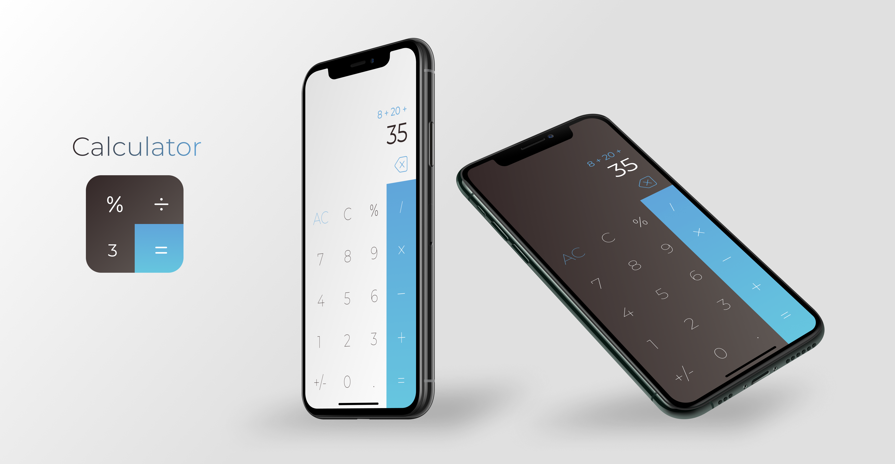

# Calculator
> #1 Personal Swift Project 

A simple calculator app for iOS made with SwiftUI

## Usage example

Download the project, open with Xcode and run!

## Features

* Layout with SwiftUI
* Dark and light theme
* Unit tests

Design inspired by this [post](https://dribbble.com/shots/5846238-Day-4-Calculator)